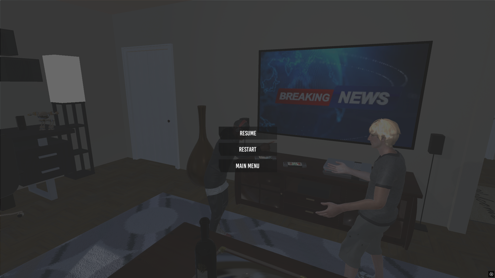
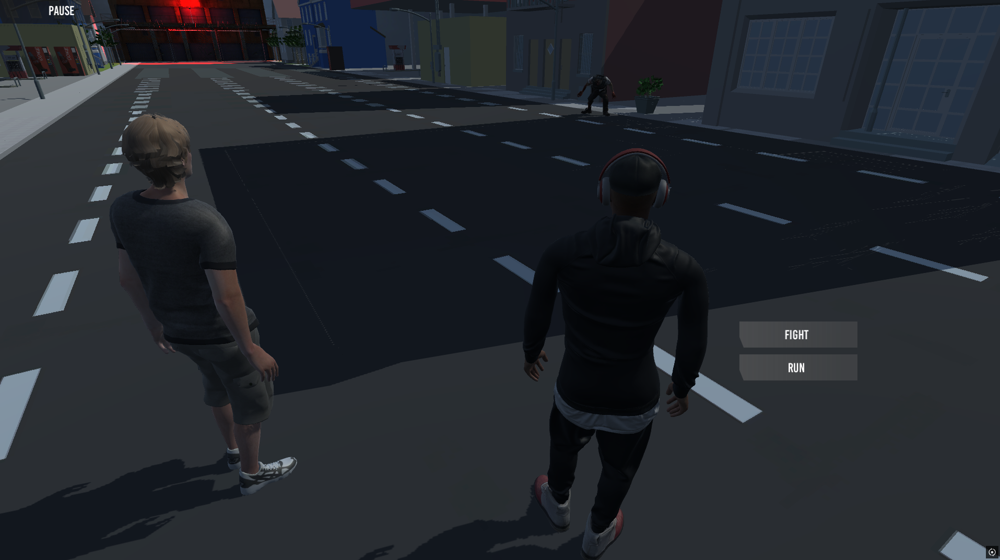
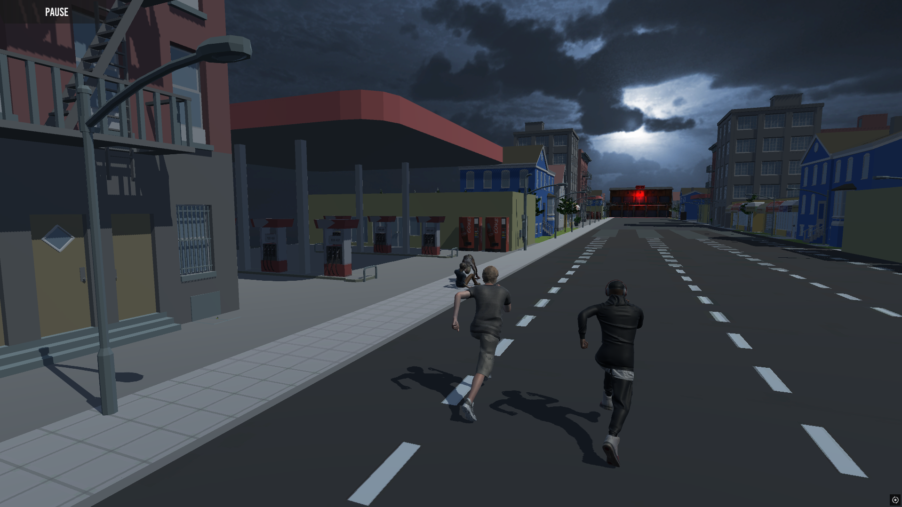
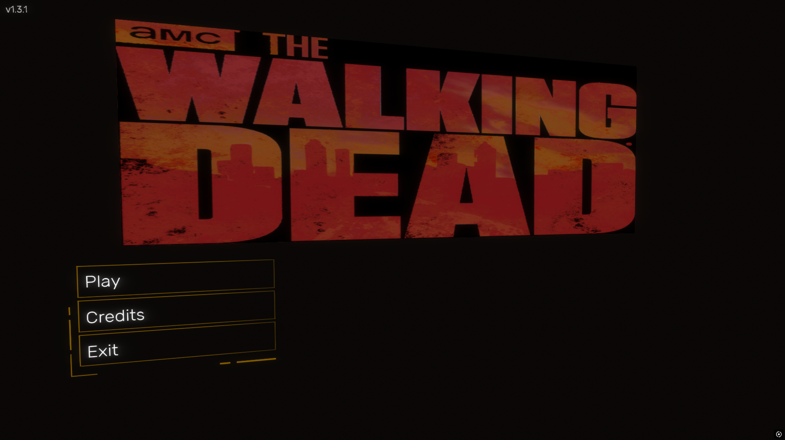

# The-Walking-Dead-Game

# 🧟 The Walking Dead: A Decision-Based Story Game


**The-Walking-Dead-Game** is a decision-based narrative game inspired by the emotional storytelling and difficult moral choices found in *The Walking Dead*.

Every decision matters.

Players are placed in tense situations where they must choose how to respond to characters, events, and unexpected challenges. Choices can influence relationships, dialogue, the direction of the story, and ultimately the outcome of the game.

Rather than focusing purely on combat, the game focuses on **player choice, consequences, character interactions, and branching narrative paths**.

---
 <!--
## 🎮 Game Preview

Experience the story and see how different decisions shape the gameplay:

**[View the Game Preview](YOUR_GAME_PREVIEW_LINK)**

--->

## 📸 Screenshots

| Story & Exploration | Decision System |
| :---: | :---: |
|  |  |
| *Explore the world and interact with characters* | *Make decisions that influence the story* |

| Character Interaction | Game Interface |
| :---: | :---: |
|  |  |
| *Interact with characters and uncover the story* | *Navigate the game's story-driven interface* |

---

## 🌟 Key Features

* **Branching Decisions:** Make choices throughout the game that can alter the direction of the story.
* **Meaningful Consequences:** Decisions can affect future events, character relationships, and available choices.
* **Interactive Storytelling:** Progress through the game by interacting with characters and responding to different situations.
* **Multiple Outcomes:** Different decisions can lead to different story paths and endings.
* **Character Relationships:** Your actions influence how characters respond to you and each other.
* **Replayability:** Play through the story again and make different decisions to discover alternative outcomes.
* **Moral Choices:** Face difficult situations where there may be no obviously correct answer.

---

## 🧠 Decision & Consequence System

The core gameplay revolves around a simple idea:

> **Your choices shape the story.**

Throughout the game, players are presented with different decisions.

For example:

```text
A survivor is injured and you have limited resources.

        ┌─────────────────────┐
        │   Help the survivor │
        └──────────┬──────────┘
                   │
             Relationship
              improves
                   │
          Future event changes


        ┌─────────────────────┐
        │   Leave them behind │
        └──────────┬──────────┘
                   │
             Relationship
              changes
                   │
          Different story path
````

Each decision can influence what happens later, creating a more personalized playthrough.

---

## 🔀 Branching Story

The game uses a branching narrative structure where the player's decisions determine which events occur next.

Different choices can lead to:

* Different dialogue
* Different character interactions
* Different events
* Different relationships
* Different available decisions
* Different story paths
* Different endings

This allows the same game to be experienced differently depending on the player's choices.
---

## 🎭 Narrative Gameplay

Instead of relying exclusively on traditional gameplay mechanics, the game places emphasis on:

* Story progression
* Character interaction
* Decision making
* Moral dilemmas
* Consequences
* Exploration
* Multiple outcomes

The goal is to make the player feel responsible for the events that unfold.

---

## 🔁 Replayability

Because the story changes based on player decisions, the game is designed to encourage multiple playthroughs.

On a second playthrough, players can make completely different choices and discover:

**Different decisions → Different consequences → Different story → Different ending**

This makes experimentation and replayability an important part of the experience.

---

## 🛠️ Installation & Setup

### For Players

1.  Navigate to the **[Google Drive Link](https://drive.google.com/file/d/18dMg7YweXpDMC2Y3C2VZBKybWvkGndsW/view?usp=sharing)**.
2. Extract the downloaded files.
3. Launch the game executable.
4. Start a new story and begin making your choices.

### For Developers

Clone the repository:

```bash
git clone https://github.com/davidsamy1/The-Walking-Dead-Game.git
```

Open the project using the appropriate development environment and follow the project structure to build and run the game.

---

## 🧩 Project Focus

This project was created to explore the implementation of:

* Decision-based gameplay
* Branching narratives
* State-dependent story progression
* Player-driven storytelling
* Character relationships
* Conditional events
* Multiple endings

The project demonstrates how software engineering concepts can be applied to create an interactive narrative experience where the game state evolves according to player decisions.

---

## 🎯 Design Philosophy

The central design philosophy of the game is:

> **There is no perfect choice — only the choice you make.**

The player should feel that their decisions have weight and that the consequences of those decisions can continue to affect the story long after the original choice was made.

---

## 📜 Credits & Inspirations

* **The Walking Dead — Telltale Games:** Primary inspiration for the decision-driven narrative structure and emphasis on meaningful player choices.
* **The Walking Dead Universe:** Inspiration for the game's post-apocalyptic setting, character conflicts, and survival themes.

This project is an independent fan-inspired project and is not affiliated with or endorsed by the respective copyright holders.

